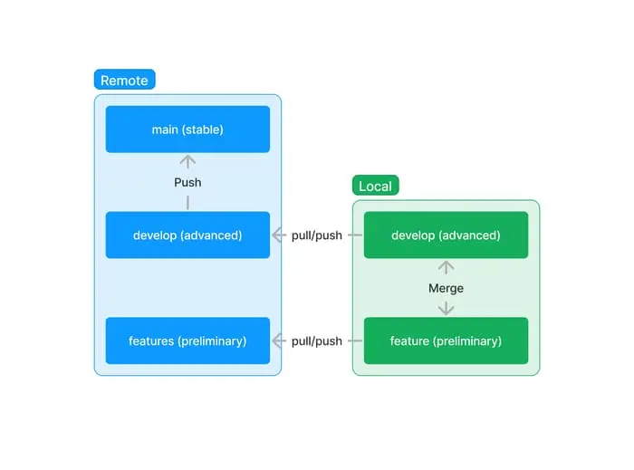

On Project development, there should be the `main` or `master` branch that the stable version of the website/application should be saved. There will be a `develop` branch where the advanced version of the website application which may potentially has bugs and errors. And also the `feature` branches, you can name the feature branch related to what feature it being developed.

Below will be the command guidelines.

## Basic Control Flow



### Guidelines

`main` branch should only have the version of the website application that is STABLE, which means it is tested and bug free. **Avoid merging** the `develop` branch to `main` if the codes is still not yet tested. Wait for the project manager's approval if needed.

`develop` branch will have the compiled codes of all the `feature` branches which means it is the ADVANCED version of the STABLE. That will also means that it might contain bugs and error that is not yet discovered.

After finishing a feature branch, merge it to the `develop` branch. Add the develop codes first your the feature branch to check if there is an error on merging, before you merge the feature to the develop branch. Run below commands





Create your branch if it still does not exist.

```sh
git checkout -b feature_name
```

or

```sh
git switch -c feature_name
```

---

after updating any changes. Create a checkpoint so if you make any errors, you can go back to previous version.

```sh
git add .
```

```sh
git commit -m "commit comment"
```

---

To see all your current logs.

```sh
git log
```

To limit the number of logs like for example 2

```sh
git log -2
```

To see the log in one line. Note: The long hash is just the same with the short hash.

```sh
git log --online
```

To checkout other version of your codes

```sh
git checkout
```

It will make a detached HEAD. to get back to your current work just switch to branch

```sh
git switch branch_name
```

---

To revert previous commit

```sh
git revert HEAD
```

to revert other commits. use the hash code you find when you generates a log to see the commits.

```sh
git revert log_code
```

For example: Below codes are generated using `git log --oneline` if you checkout the `c6244bf` and you would like to revert to that version. You have to revert the `d7fea52` commit.

```sh
a1b6c00 (HEAD -> master) M4
d7fea52 M3
c6244bf M2
d84caf1 M1
```

please note that revert will creates a new commit.

---

after end of the day, update the remote repository for backup and as well as other developer might work on it. Please note that when pushing a local repository that do not have a remote repository, it will ask you to run 1 more command so please read the git notification. If you already have existing branch, make sure you run `git pull` first before you push changes.

```sh
git push
```

When you are going back to work on your feature. make sure you are in the correct branch (green branch means it is the one selected)

```sh
git branch --list
```

if you are not in the correct branch, switch to your branch.

```sh
git switch feature_branch
```

And also make sure that your codes are update whenever you are just starting to work with an existing branch.

```sh
git pull
```





1. go to your local repository `develop` branch

```sh
git switch develop
```

2. make sure that your local repository `develop` branch is updated

```sh
git pull
```

3. switch to the feature1 branch

```sh
git switch feature1
```

4. make sure your local repository `feature1` branch is updated

```sh
git pull
```

5. get the updated codes from the `develop` branch to your `feature1` branch

```sh
git merge develop
```

6. Fix the merge conflicts and after testing that it is working fine. You can switch to the `develop` branch and get the updated codes from the `feature1` branch.

```sh
git switch develop
```

```sh
git merge feature1
```

7. Fix the merge conflicts again. then push your updated `develop` branch codes from your local repository to the remote repository.

```sh
git push
```



If the develop branch code version is already well-tested by the team with no issue. we can now then push the changes to the main branch which is our STABLE version of your website application project.



1. Switch to the develop branch and make sure it is updated

```sh
git switch develop
```

```sh
git pull
```

2. Switch to the main branch and make sure it is updated

```sh
git switch main
```

```sh
git pull
```

3. Merge or absorb the updated codes from the develop branch

```sh
git merge develop
```

4.after fixing the merge conflict. push the updated codes to the git remote repository

```sh
git push
```


